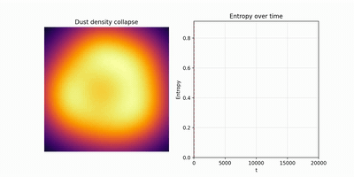
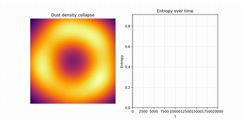
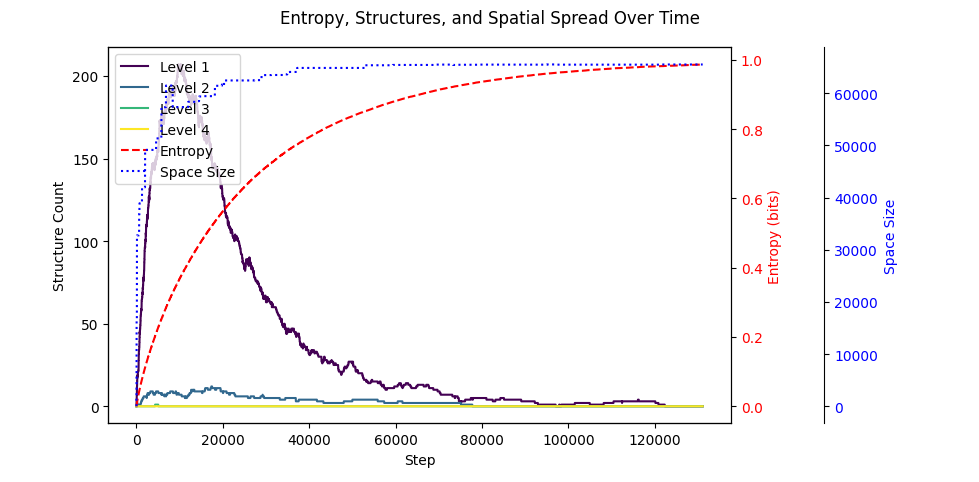
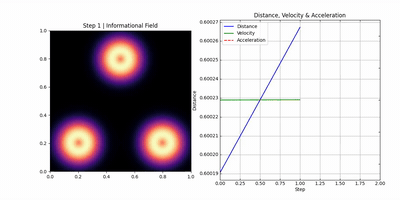

# Emergence Laboratory: Visual Demonstrations

<table>
  <tr>
    <td>
      This section admits no simulation. 
    </td><td valign="top">
Ontological equivalence, substrate independence, and the observer-relative nature of time and experience. 
A static set of white noise can encode arbitrarily many coherent observer-relative worlds.
    <i><a href="https://juhameskanen.github.io/abstract/informational-derivation-of-reality/informational-derivation-of-reality-informational-derivation-of-reality.pdf">Paper-1: Informational Derivation of Reality</a></i>
  </td></tr>
  <tr>
    <td>
      
       <i>Schwarzschild</i>
    </td><td valign="top">
This simulation visualizes a collapsing dust cloud in a Schwarzschild spacetime and tracks the system's entropy over time. Although numerical instabilities and the breakdown of GR prevent the simulation from reaching the final state, the execution trace of the simulating computer demonstrates a monotonic decrease in Shannon entropy. By extrapolating this trend to the limit we conclude that the singularity corresponds to a zero-information state.
       <a href="https://juhameskanen.github.io/abstract/black-hole-singularities/index.html">Paper-II:  Singularities as Zero-Entropy States</a>
    </td>
  </tr>
  <tr>
    <td>
      
       <i>Paper-2: Kerr</i>
    </td><td valign="top">
Simulation tracking a collapsing dust cloud within a Kerr (rotating) spacetime. While the resulting singularity is geometrically ring-like, the execution trace of the simulating computer demonstrates the same monotonic decrease in Shannon entropy observed in the Schwarzschild case. We conclude that even a ring singularity represents a zero-information state: an entropy-null region where the geometric structure lacks the informational capacity to sustain energy, particles, or gravitational influence. As the system trends toward zero information, the available microstates vanish; consequently, the probability of any particle state manifesting within the singularity is zero.
    </td>
  </tr>
  <tr>
    <td>
      
       <i>Paper-3: Emergence of Spacetime</i>
    </td><td valign="top">
In the time-reversed scenario, we observe the unfolding of spacetime driven by increasing entropy. The system expands rapidly during the initial low-entropy phase, mirroring the early universe's growth. However, as the bitstring approaches maximum entropy, the expansion rate naturally decelerates, following the saturation curve toward equilibrium. In this model, the 'force' of expansion is an entropic drift that stabilizes as information density reaches its peak, suggesting a universe that matures toward a smooth, high-entropy limit rather than an accelerated heat death.
       <a href="https://juhameskanen.github.io/abstract/black-hole-singularities/index.html">Paper-3: Emergence of Spacetime</a>
    </td>
  </tr>
    <tr>
    <td>
      
       <i>Minimal observer emergence simulation</i>
    </td><td valign="top">
A minimal demonstration of how smoothness and predictability emerge as the most probable configurations of information compatible with an inability to see microstates. By applying a Gibbs complexity prior to raw bit-histories, we see 'Physics' emerge: the chaotic micro-history (top) is filtered into a predictable, persistent macro-trajectory (bottom). The observer is the filtering algorithm (Hamming distance).
    </td>
  </tr>
      <tr>
    <td>
      
       <i>2D observer simulation using Born-rule</i>
    </td><td valign="top">
By implementing the Born Rule (P=∣⟨ψ∣ϕ⟩∣2) as the acceptance criterion for the Metropolis-Hastings sampler, we are no longer just "averaging" data. We are simulating a universe where the probability of a physical state existing is determined by its correlation with the observer.
    </td>
  </tr>
  <tr>
    <td>
      
       <i>Emergent quantum interference</i>
    </td><td valign="top">
By modeling observers as Gaussian blobs, quantum interference and an emergent 'pull' force arise as the most statistically probable outcomes. The observer perceives the universe 'waving' according to a deterministic, complex-valued wavefunction because they are observing compressed information.
    </td>
  </tr>
    <tr>
    <td>
      
       <i>Emergent attraction and inertia</i>
    </td><td valign="top">
Informationally complex Gaussian distributions exhibit effective gravitational attraction and inertial persistence as emergent properties of compression-optimal observer trajectories.
Smooth, predictable observer paths admit maximal compression and therefore dominate the measure of realizable histories from which Gaussian structures are statistically expected to arise.     
    </td>
  </tr>
</table>

