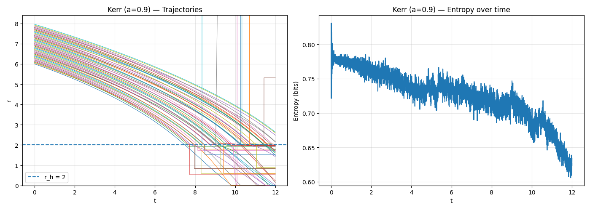

# Black Hole Singularities as Zero Entropy States

*The Abstract Universe Project, 2025*

---

## Abstract

We investigate black hole singularities from an information-theoretic perspective,  
viewing geometric spacetime and computational simulation as two equivalent interpretations  
of an underlying informational structure. We introduce the notion of **execution-trace entropy**,  
the Shannon entropy of a fixed encoding of the simulated spatial configuration, and show that  
it decreases monotonically as particles approach the singularity. Our results indicate that singularities  
should be understood as well-defined, smooth informational fixed points corresponding to zero-entropy states.

---

## Introduction

We apply a computational and information-theoretic framework to black hole singularities.  
The guiding hypothesis is that spacetime geometry and the execution of a simulation  
can be viewed as complementary descriptions of the same underlying informational structure.

Our central question is whether approaching singularities as information-theoretic phenomena  
provides new insights into their structure and physical interpretation. To explore this,  
we develop both analytic reasoning and numerical simulations of collapsing dust clouds.

---

## Methods

We model black hole evolution through computational simulation.  
We compute the **execution-trace entropy** of the discretized particle positions,  
which captures the number of distinguishable geometric configurations encoded in memory.

### Execution Trace

Let $\mathcal{M}$ denote the set of all memory locations in a deterministic computing system.  
A **machine state** $\mathcal{S} \in \mathcal{M}$ is a complete assignment of values  
to all memory elements. Let $\mathcal{P} = (I_1, I_2, \dots, I_n)$ be a finite sequence of deterministic instructions,  
with $I_k : \mathcal{S} \rightarrow \mathcal{S}$. The **execution trace** $\mathcal{T}$ of program $\mathcal{P}$  
is the ordered sequence of states

$$
\mathcal{T} = (s_0, s_1, \dots, s_n), \quad s_{k+1} = I_{k+1}(s_k).
$$

The execution trace encodes all information about the simulated phenomenon.  
In practice, we focus on the **bitstring sub-trace** that encodes spatial geometry.

### Mapping Geometry to Bitstrings

Let a geometric state be encoded as a bitstring $b \in \{0,1\}^L$, representing the discretized positions  
of all particles in the dust cloud. Let

$$
C = \{0,1\}^{3k}
$$

be the space of 3D configurations. Define

$$
f : C \to \mathbb{Z}^3, \quad f(b) = (\phi(b_1), \phi(b_2), \phi(b_3)),
$$

where $\phi : \{0,1\}^k \to \mathbb{Z}$ decodes fixed-length binary segments.  
Quantization ensures that the encoding reflects true positional differences,  
minimizing spurious entropy from floating-point representations.

### Execution-Trace Entropy

To quantify distinguishable configurations, we compute the Shannon entropy of the bitstring representation:

$$
H(b) = -p_0 \log_2 p_0 - p_1 \log_2 p_1,
$$

where $p_0$ and $p_1$ are the empirical frequencies of 0- and 1-bits in $b$.  

**Important clarification:** This entropy is *not* thermodynamic entropy or ensemble Shannon entropy.  
It measures the number of distinguishable configurations encoded in a deterministic simulation at a given timestep.

Over a sequence of states (the bitstring sub-trace), the entropy trajectory reflects the collapse of distinguishable geometric states as particles fall toward the singularity.

---

## Simulations

We simulated both Schwarzschild (non-rotating) and Kerr (rotating) black holes.  
All simulations show a monotonic decrease in execution-trace entropy as particles fall inward.  
Extrapolation indicates that entropy approaches zero at the singularity.

### Lemma: Vanishing Execution-Trace Entropy Implies Geometric Singularity

Let $\mathcal{B}_t \subset \{0,1\}^L$ denote the set of bitstrings encoding geometry over a finite time window near $t$.  
If

$$
H(\mathcal{B}_t) \to 0,
$$

then the set of distinguishable geometric configurations collapses to a single equivalence class under $f$. That is, the geometry degenerates to a unique configuration.

---

## Discussion

Our simulations confirm the Entropy–Singularity Lemma in a computational context.  
Although global black hole thermodynamic entropy increases, the local execution-trace entropy encoding spatial geometry decreases toward the singularity.  
This reflects the narrowing of accessible informational states and growing determinism in geometry.

### Singularities as Smooth Informational Fixed Points

The term “singularity” does not denote divergent curvature or ill-defined geometry in our framework.  
Instead, it denotes a collapse of distinguishable geometric degrees of freedom.  
The zero-entropy limit corresponds to a unique, maximally symmetric equivalence class.  
This state is smooth (no relational variation) but singular in that it supports no internal structure, particles, or local observables.

### Bitstring Encoding Procedure

To encode geometry:

1. Quantize continuous coordinates: $\mathbb{R} \to \mathbb{Z}$  
2. Convert integers to fixed-width binary strings  
3. Concatenate binary segments into a full state bitstring  

Entropy is then computed as above. The collapse of this entropy directly reflects the loss of distinguishable structure.

---

## Conclusion

Black hole simulations cannot directly resolve classical singularities due to numerical instability and breakdown of general relativity.  
However, execution-trace entropy analysis reveals that singularities correspond to zero-entropy states: well-defined, smooth informational fixed points with no internal structure.  
This reframes singularities as informational phenomena rather than divergent densities, supporting the broader information-theoretic interpretation of spacetime.

---

## Simulation Code

Source code is available for:

- `schwarzschild.py` — Schwarzschild black hole simulation  
- `kerr.py` — Kerr black hole simulation  
- `blackhole.py` — common base classes
