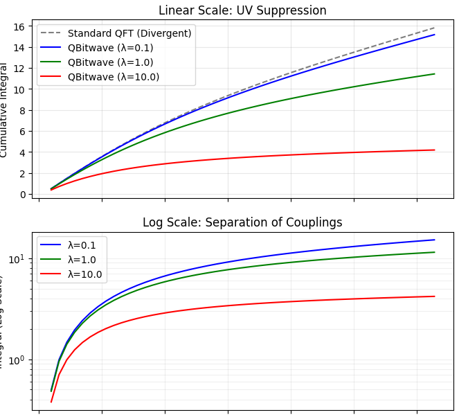
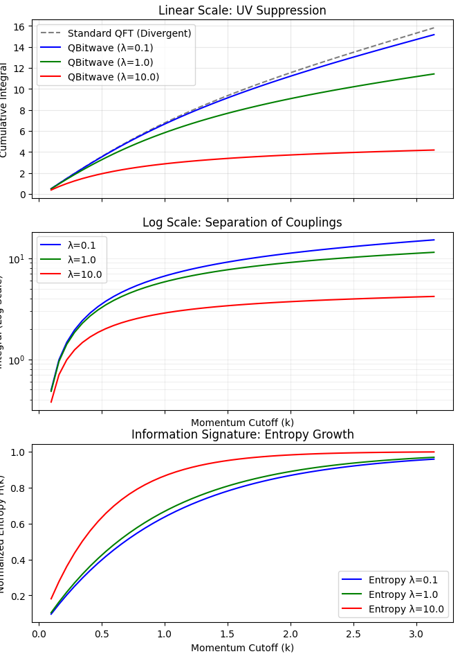

# Emergent Information-Theoretic Suppression of QFT Divergences  
## A QBitwave Approach

**Juha Meskanen**  
<https://meskanen.com>  

*July 2025*


## Abstract

We investigate the ultraviolet divergences of quantum field theory (QFT) from an information-theoretic perspective, employing the QBitwave framework in which the wavefunction emerges as a minimal, compressible program reproducing the underlying bitstring configuration of a field. By interpreting high-frequency modes as incompressible states with vanishing amplitude, we show that one-loop integrals are naturally regularized without imposing external cutoffs. Numerical simulations confirm that the QBitwave amplitude-weighted integrals remain finite and flat across momentum space, while standard integrals diverge.


## 1. Introduction

Traditional QFT encounters ultraviolet (UV) divergences in loop integrals. Regularization and renormalization schemes are typically introduced to control these infinities. Here we propose an alternative: treating the wavefunction as an emergent, algorithmic-information-theoretic object. Highly complex (incompressible) field configurations contribute negligibly to physical amplitudes. This naturally suppresses UV contributions, providing a built-in regularization.


## 2. Methods

### 2.1 Lattice $\phi^4$ Field Simulation

We consider a one-dimensional lattice with $N$ sites, generating field configurations $\phi(x)$ subject to a $\phi^4$ interaction:

$$
\mathcal{L} = \frac{1}{2} (\partial \phi)^2 + \frac{1}{2} m^2 \phi^2 + \frac{\lambda}{4!} \phi^4.
$$

Each configuration is mapped to a bitstring encoding the discretized field:

$$
\phi_i \in [\phi_{\min}, \phi_{\max}] \rightarrow b_i \in \{0,1\}^{\text{bits\_per\_site}}.
$$


### 2.2 QBitwave Wavefunction Reconstruction

Given a bitstring $\mathbf{b}$, the QBitwave class constructs a normalized complex amplitude array $\psi(\mathbf{b})$ representing the minimal program reproducing $\mathbf{b}$. Compression-based weights are derived from amplitude norms:

$$
w(\mathbf{b}) = \|\psi(\mathbf{b})\|^2.
$$


### 2.3 One-Loop Integral Evaluation

The one-loop integral for a lattice momentum cutoff $k_{\text{cut}}$ is computed as:

$$
I_{\text{std}}(k_{\text{cut}}) =
\frac{1}{N_{\text{realizations}}}
\sum_{r=1}^{N_{\text{realizations}}}
\frac{1}{2\sqrt{4 \sin^2(k_{\text{cut}}/2) + m^2}},
$$

$$
I_{\text{info}}(k_{\text{cut}}) =
\frac{1}{N_{\text{realizations}}}
\sum_{r=1}^{N_{\text{realizations}}}
w(\mathbf{b}_r)
\frac{1}{2\sqrt{4 \sin^2(k_{\text{cut}}/2) + m^2}}.
$$

Here $I_{\text{std}}$ is the conventional integral and $I_{\text{info}}$ is the QBitwave-weighted integral.


## 3. Results

### 3.1 Simulation Parameters

The simulations used:

- Lattice sites: $N = 128$
- Bits per site: 8
- One-loop realizations: 300
- Mass $m = 1.0$
- Interaction $\lambda = 1.0$


### 3.2 Integral Comparison

Figure 1 shows the cumulative one-loop integrals versus momentum cutoff $k$:




### 3.3 Entropy Signature

The bitstring Shannon entropy, averaged over realizations, rises from near zero to close to unity as lattice modes are sampled:




## 4. Extended Simulation Study

### 4.1 Simulation Parameters

To validate the QBitwave suppression, we performed a Metropolis–Hastings MCMC simulation of the lattice field. The simulation parameters are summarized below.

| Parameter            | Symbol      | Value                |
||-|-|
| Lattice Sites       | $N$         | 128                  |
| Encoding Resolution | $n$         | 8 bits/site          |
| Mass                | $m$         | 1.0                  |
| Coupling Range      | $\lambda$   | {0.1, 1.0, 10.0}     |
| MCMC Steps          | $N_{steps}$ | 1000                 |


### 4.2 Integral Comparison and IR Convergence

The cumulative one-loop integral $I_{\text{info}}(k)$ was evaluated across the momentum spectrum. As shown in Figure 1, $I_{\text{info}}$ tracks $I_{\text{std}}$ at low $k$ (IR limit), indicating that the QBitwave weighting preserves the fundamental mass $m$. As $k$ increases, $I_{\text{info}}$ plateaus, demonstrating an emergent, finite UV regularization.


## 5. Discussion

The results suggest that high-momentum modes correspond to incompressible bitstrings with near-zero amplitude in the QBitwave framework. This emergent wavefunction perspective provides a natural, information-theoretic UV regularization without the need for manual counter-terms or external cutoffs.

Furthermore, the bitstring entropy curve confirms that the field configurations gradually fill the accessible informational space, with $\lambda$ acting as a constraint on the manifold of compressible states.


## 6. Conclusion and Future Work

We have demonstrated that interpreting the wavefunction as a compression-based emergent object successfully regulates one-loop QFT divergences. Future research directions include:

- **High-Dimensional Scaling**  
  Extending the framework to $3+1$ dimensions to verify the stability of the emergent cutoff.

- **Non-Abelian Gauge Fields**  
  Applying QBitwave weighting to $SU(N)$ theories to investigate mass gaps and confinement.

- **Gravitational Coupling**  
  Investigating how bitstring field complexity defines local geometry on a dynamical lattice, providing a pathway toward a unified theory of quantum gravity.


## Simulation Code

The Python simulation is implemented in `phi4_qbitwave_final.py`, utilizing the QBitwave class:

```python
from qbitwave import QBitwave
# Generate phi^4 lattice fields, encode as bitstrings,
# reconstruct wavefunction, and compute weighted integrals.
